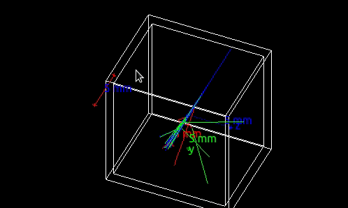

## This a geant4 training materials

visit <a href="https://geant4.cern.ch">Geant4</a> for more information.

## Tools

C++, Geant4 toolkit, ROOT, PyROOT

## Screenshot

# First simulation, G4Box, e- and e+ 100 MeV guns

